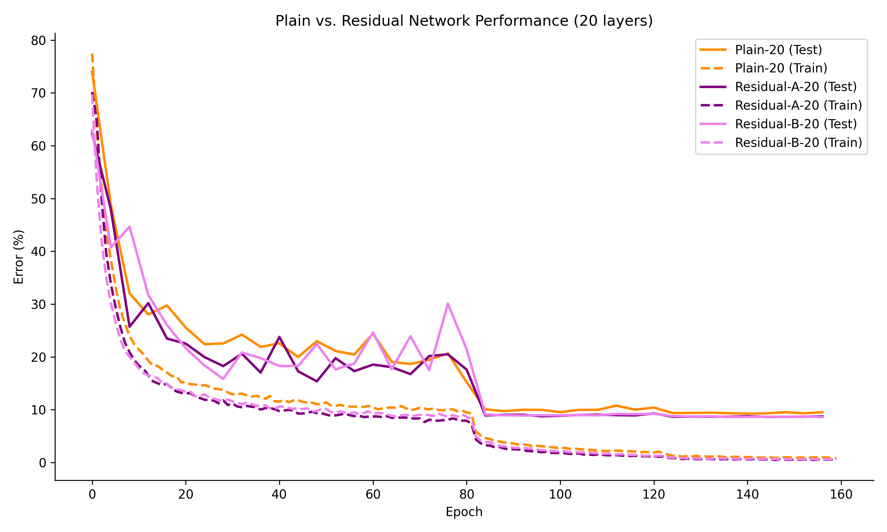
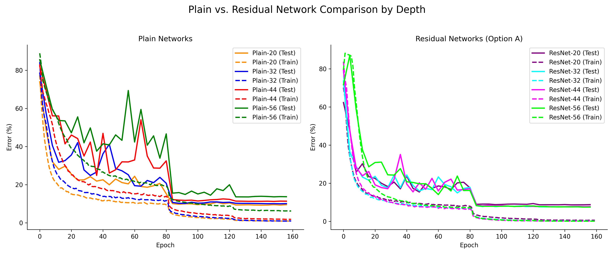

# Deep Residual Learning for Image Recognition - PyTorch

A faithful PyTorch reproduction of the CIFAR-10 experiments from [Deep Residual Learning for Image Recognition](https://arxiv.org/abs/1512.03385) (He et al., 2015). Implements plain and residual networks at depths 20/32/44/56/110 with both shortcut options A (zero-padding) and B (1x1 projection), following Section 4.2 of the paper exactly.


## Quick Start

```bash
uv sync
uv run train.py 20 -r -o A          # Train ResNet-20 with Option A shortcuts
uv run train.py 56 -r -o A          # Train ResNet-56
uv run results_plot.py --show        # Generate comparison plots
```

## Results

### CIFAR-10 Test Error Rates (%)

| Model     | Params | Paper | This Repo |
|-----------|--------|-------|-----------|
| Plain-20  | 0.27M  | -     | 9.26      |
| Plain-32  | 0.46M  | -     | 10.00     |
| Plain-44  | 0.66M  | -     | 11.22     |
| Plain-56  | 0.85M  | -     | 13.58     |
| ResNet-20 | 0.27M  | 8.75  | 8.64      |
| ResNet-32 | 0.46M  | 7.51  | 7.56      |
| ResNet-44 | 0.66M  | 7.17  | 7.62      |
| ResNet-56 | 0.85M  | 6.97  | 7.47      |
| ResNet-20 (B) | 0.27M | - | 8.62      |

> Paper values from Table 6. Plain networks exhibit the degradation problem (deeper = higher error), while residual networks improve with depth, matching the paper's key finding.

### Training Curves





## Architecture

CIFAR-10 networks use the 6n+2 layer structure from Section 4.2:

- **Input:** 32x32 RGB image, per-channel normalized
- **Stage 1:** n layers of 3x3 conv on 32x32 feature maps, 16 filters
- **Stage 2:** n layers of 3x3 conv on 16x16 feature maps, 32 filters
- **Stage 3:** n layers of 3x3 conv on 8x8 feature maps, 64 filters
- **Output:** Global average pooling, 10-way fully connected, softmax

Downsampling between stages uses stride-2 convolutions. Shortcut connections use either zero-padding (Option A) or 1x1 projections (Option B).

ImageNet models (ResNet-18/34/50/101/152) are also implemented with both BasicBlock and BottleneckBlock variants.

## Implementation Details

All hyperparameters follow Section 4.2:

- **Optimizer:** SGD, momentum 0.9, weight decay 1e-4
- **Learning rate:** 0.1, divided by 10 at 32k and 48k iterations. For n >= 56, starts at 0.01 for one epoch then steps to 0.1 (warm-up)
- **Batch size:** 128
- **Epochs:** 160 (~64k iterations on CIFAR-10)
- **Augmentation:** 4-pixel zero-padding + 32x32 random crop, random horizontal flip (Section 4.2)
- **Normalization:** Per-channel mean/std normalization
- **Weight init:** Kaiming He initialization (He et al., 2015b)

## Project Structure

```
models.py           Model definitions (CifarResNet, ImageNetResNet, BasicBlock, BottleneckBlock)
train.py            Training script for CIFAR-10 experiments
test.py             Unit tests for model dimensions, parameter counts, forward-backward
results_plot.py     Generates comparison plots from training logs
run_experiments.sh  Trains all variants and generates plots
arch.png            Architecture diagram
```

## Running Tests

```bash
uv run python -m pytest test.py -v
```

## References

```
@article{he2015deep,
  title={Deep Residual Learning for Image Recognition},
  author={He, Kaiming and Zhang, Xiangyu and Ren, Shaoqing and Sun, Jian},
  journal={arXiv preprint arXiv:1512.03385},
  year={2015}
}
```
